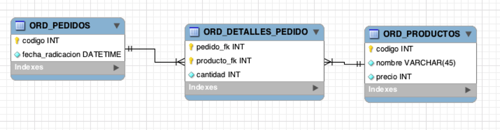

### Escuela Colombiana de Ingeniería
### Procesos de desarrollo de Software – PDSW
### Capa de persistencia – Introducción Patrón DAO y JDBC


En un motor de base de datos MySQL Se tiene un esquema con el siguiente modelo de base de datos (un registro de pedidos de productos):



1.	Revise la documentación de ‘PreparedStatement’, del API JDBC:
http://docs.oracle.com/javase/tutorial/jdbc/basics/prepared.html

2.	Ajuste los parámetros de conexión:
    ```
        String url="jdbc:mysql://desarrollo.is.escuelaing.edu.co:3306/bdprueba";
        String driver="com.mysql.jdbc.Driver";
        String user="bdprueba";
        String pwd="bdprueba";
    ```

4.	Implemente las operaciones faltantes (la operación que hace el cálculo del valor de un pedido debe hacerlo mediante SQL). Para la operación c  use su código de estudiante, de manera que no haya conflicto con sus compañeros (todos están usando la misma base de datos).

    a. nombresProductosPedido

    b. valorTotalPedido

    c. registrarNuevoProducto

5.	Ejecute las operaciones y rectifique los resultados. Operaciones a y b por pantalla, operacióne c consultando en la base de datos con un cliente MySQL.
